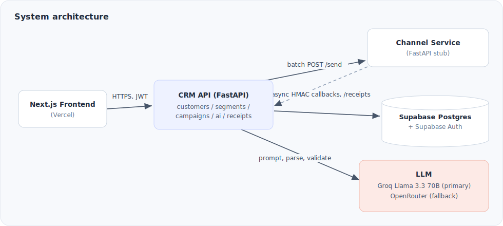
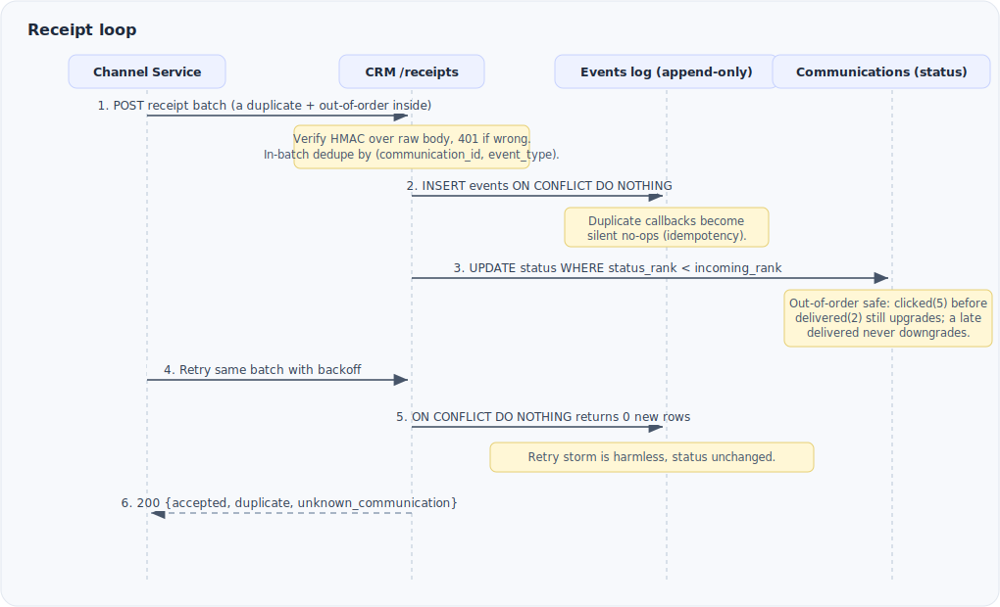

# xeno-crm-backend

AI-native mini CRM backend for reaching D2C shoppers. Two FastAPI services that
share nothing at runtime and communicate over HTTP only:

- `crm_api/` is the main CRM: ingest, segments, campaigns, AI endpoints, and the
  receipt callback API.
- `channel_service/` is a stubbed messaging channel: it simulates delivery
  outcomes and calls back into the CRM receipt API.

The product bet is explainable AI: every AI output ships with the reasoning that
produced it, so a human can verify the decision before acting on it.

## Architecture



Four deployable units: the frontend (Vercel), the CRM API, the channel service
(a separate deployment, as the brief mandates), and Supabase (Postgres plus
Auth). The two backend services live in this repo as two apps with two
Dockerfiles and no shared runtime imports.

## Receipt loop semantics

The receipt loop is the system-design centerpiece. The channel service does not
deliver anything; it simulates outcomes and posts them back asynchronously, out
of order, with deliberate duplicates and retries. The CRM ingests these and
keeps each communication's state correct under all of that.



How each property is enforced:

1. Idempotency. The event log carries `UNIQUE(communication_id, event_type)`.
   Inserts use `ON CONFLICT DO NOTHING`, so a duplicate callback is a silent
   no-op. A retry storm of the same batch adds zero new rows and changes
   nothing.
2. Out-of-order events. Status has a precedence rank: queued, sent, delivered,
   opened, read, clicked, converted, with `failed` terminal between sent and
   delivered. `communications.status` upgrades only when the incoming rank is
   strictly greater than the stored `status_rank`. The conditional
   `UPDATE ... WHERE status_rank < incoming` lets the database enforce
   never-downgrade without a read-modify-write race. A `clicked` that arrives
   before `delivered` still lands correctly; the late `delivered` is recorded in
   the append-only log but does not downgrade the status.
3. Retries and durability. The channel retries failed callbacks with backoff.
   The CRM endpoint is safe to retry against because of idempotency, and it
   commits before responding, so a 200 means the batch is durable.
4. Attribution. A `converted` event creates one order attributed to the
   campaign. Two independent idempotency layers (the event unique constraint and
   an `external_id` of `conv_{communication_id}` inserted with
   `ON CONFLICT DO NOTHING`) guarantee a duplicate or out-of-order `converted`
   never creates a second order.
5. Append-only. `communication_events` is only ever inserted into. A grep over
   `crm_api` shows no UPDATE or DELETE against it anywhere.

HMAC verification runs over the raw request body with `compare_digest` and
returns 401 before any parsing if the signature is missing or wrong.

## Scale path

Everything below runs as direct transactional writes at demo scale. Each item
names the swap and keeps the public interface stable, so the change is internal.

| Concern | Demo scale (built) | At 1000 concurrent users (swap to) |
|---|---|---|
| Receipt processing | Direct transactional writes, batch-shaped `/receipts` | Redis or SQS buffer plus batch flush behind the same `/receipts` interface |
| Campaign dispatch | Synchronous in-request, batches of 50 | Background worker or queue consumer behind the same `dispatch_campaign` interface |
| Stats freshness | 5s polling of `/stats` | Server-sent events or websocket push |
| Per-rule audience impact | One count query per rule leaf (50-leaf cap) | Single windowed query |
| Customer aggregates | Denormalized columns updated in the write transaction | Materialized view with scheduled refresh |
| Auth | HS256 shared-secret JWT verification | JWKS asymmetric verification against Supabase |
| LLM calls | Per-request, four-attempt backoff with provider fallback | Response cache plus a request queue, token streaming for long calls |

## Tradeoff log

| Decision | Chose | Over | Because |
|---|---|---|---|
| Receipt processing | Direct transactional writes, batch-shaped API | Redis or SQS queue | Demo scale; interface designed for the swap |
| Stats freshness | 5s polling | Websockets | Complexity not justified at this scope |
| Customer aggregates | Denormalized columns | Join-time aggregation | Segment query speed; documented matview path |
| Auth | Supabase Auth | Hand-rolled JWT | Buys back about a day; production credible |
| LLM | Groq plus fallback | Self-hosted model | Latency and zero infra; fallback covers instability |
| Event log | Append-only plus derived status | Status-only mutation | Auditability, idempotency, debuggability |
| Order re-ingest | `ON CONFLICT DO NOTHING` | `DO UPDATE` | Re-updating an amount would silently corrupt aggregates |
| Proposal lifecycle | `proposal_state` in existing JSONB | Widen `campaigns.status` enum | No migration, no schema deviation, S8 and S9 untouched |

## API surface

CRM API, prefix `/api/v1`, all routes JWT-gated except receipts (HMAC) and
health:

- `POST /customers/bulk`, `POST /orders/bulk`, `POST /customers/upload`, `GET /customers`
- `POST /segments`, `GET /segments/{id}`, `POST /segments/preview`
- `POST /campaigns`, `GET /campaigns`, `GET /campaigns/{id}`,
  `POST /campaigns/{id}/dispatch`, `GET /campaigns/{id}/stats`,
  `POST /campaigns/{id}/approve`, `POST /campaigns/{id}/execute`
- `POST /ai/nl-to-segment`, `POST /ai/draft-messages`,
  `GET /ai/campaigns/{id}/insight`, `POST /ai/propose-campaign`
- `POST /receipts` (HMAC-signed, machine to machine)

Channel service: `POST /send` (batch, 202), `GET /dead-letters`, `GET /healthz`.

## Stack

Python 3.12, FastAPI, SQLAlchemy 2.0 async, Alembic, Pydantic v2, httpx,
pytest with pytest-asyncio, ruff for lint and format. Postgres via Supabase.
LLM via Groq primary and OpenRouter fallback, both behind
`crm_api/services/llm_client.py`.

## Run it

CRM API:

```bash
uvicorn crm_api.main:app --reload --port 8000
```

Channel service:

```bash
uvicorn channel_service.main:app --reload --port 8001
```

Seed about 600 customers and 2500 orders through the production service path:

```bash
python -m scripts.seed
```

Migrations (Alembic only, never edit the database by hand):

```bash
alembic upgrade head
```

Tests and lint:

```bash
pytest -x -q
ruff check . && ruff format --check .
```

## Environment

Set these in `.env` (gitignored). See `.env.example` for the full list.

| Variable | Purpose |
|---|---|
| `DATABASE_URL` | Supabase Postgres session-pooler URI (asyncpg) |
| `SUPABASE_JWT_SECRET` | Verifies frontend JWTs (HS256) |
| `CHANNEL_HMAC_SECRET` | Shared secret signing the receipt callbacks |
| `CHANNEL_SEND_URL` | Channel service `/send` endpoint the CRM dispatches to |
| `CRM_RECEIPTS_URL` | CRM `/receipts` endpoint the channel calls back (channel service) |
| `GROQ_API_KEY`, `GROQ_MODEL` | Primary LLM provider |
| `OPENROUTER_API_KEY`, `OPENROUTER_MODEL` | Fallback LLM provider |

Secrets are never committed. Update `.env.example` whenever a new variable is
added.
