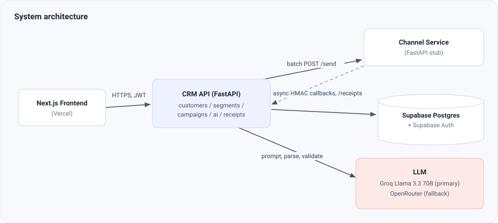
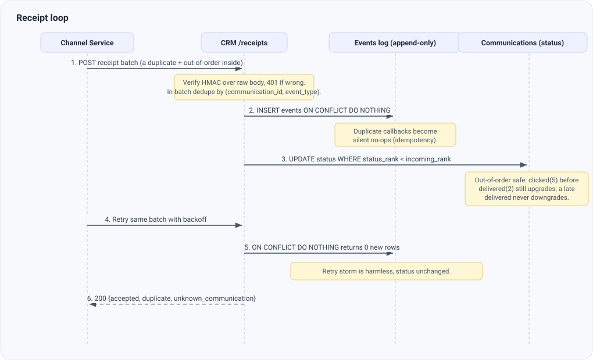

# Lumen CRM backend

**A lightweight CRM for small D2C brands that need Klaviyo-level customer
intelligence without Klaviyo-level complexity.**

Lumen is a multi-tenant customer-intelligence platform. It ingests customers
and orders, scores every customer for reactivation risk and expected value with
real ML, and serves a decision layer: which customers are leaking revenue, why,
what to do, and the money it is worth.

**ICP:** 5-person direct-to-consumer teams that have a few thousand customers
and no data team. The founder opens Lumen Monday morning and gets one answer:
"Who should I talk to today, and why?"

Two FastAPI services share nothing at runtime and communicate over HTTP only:

- `crm_api/` is the main API: ingest, segments, campaigns, the ML serving and
  money endpoints, AI endpoints, and the receipt callback API.
- `channel_service/` is a stubbed messaging channel: it simulates delivery
  outcomes and calls back into the CRM receipt API.

The product bet is explainable AI: every decision ships with the reasoning that
produced it, so a human can verify it before acting.

**Live:** [lumencrm-frontend.vercel.app](https://lumencrm-frontend.vercel.app)
| Backend: [lumen-backend-3s2u.onrender.com](https://lumen-backend-3s2u.onrender.com)

## Customer intelligence layer

The `ml/` package is a reproducible, leak-safe pipeline. It runs on the real
Olist Brazilian e-commerce dataset (about 96k customers, 99k orders).

- **Leak-safe features and split.** Features use only orders on or before a
  temporal cutoff; the reactivation label looks strictly forward. Encoders and
  scalers are fit on train only. One pipeline serves train and inference, so
  there is no train/serve skew. See `ml/features.py`, `ml/split.py`.
- **Honest evaluation.** A HistGradientBoosting reactivation model, judged on
  PR-AUC, ROC-AUC, and Brier, never accuracy. Test PR-AUC 0.026 against a 0.012
  base rate (about 2.2x lift), ROC-AUC 0.61. Weak but real, which is the correct
  finding for a marketplace that is about 97 percent one-time buyers. See
  `ml/artifacts/model_card_latest.json`.
- **Calibration is the ML win.** Class weighting inflates raw probabilities
  (Brier 0.211). Isotonic calibration fit on validation only brings Brier to
  0.0116, an 18x gain, which is what makes the expected-value math trustworthy.
- **Explainability.** Per-customer SHAP reasons, aggregated to base features, are
  precomputed into `customer_scores`. See `ml/score.py`.
- **Decision layer.** `Customer to calibrated risk to SHAP reason to recommended
  action to expected revenue`, tenant-scoped. See
  `crm_api/services/scores_service.py`.

## Multi-tenancy

Every core table carries a `tenant_id`. The JWT carries a `tenant_id` claim
(Supabase app_metadata), read in `crm_api/auth.py` and enforced in the insights
and P&L reads. The backend connects with a service role, so isolation is
application-layer; per-user Postgres RLS with a request GUC is the documented
alternative.

## Architecture



Four deployable units: the frontend (Vercel), the CRM API, the channel service
(a separate deployment, as the brief mandates), and Supabase (Postgres plus
Auth). The two backend services live in this repo as two apps with two
Dockerfiles and no shared runtime imports.

## Receipt loop semantics

The receipt loop is the system-design centerpiece. The channel service does not
deliver anything; it simulates outcomes and posts them back asynchronously, out
of order, with deliberate duplicates and retries. The CRM ingests these and
keeps each communication's state correct under all of that.



How each property is enforced:

1. Idempotency. The event log carries `UNIQUE(communication_id, event_type)`.
   Inserts use `ON CONFLICT DO NOTHING`, so a duplicate callback is a silent
   no-op. A retry storm of the same batch adds zero new rows and changes
   nothing.
2. Out-of-order events. Status has a precedence rank: queued, sent, delivered,
   opened, read, clicked, converted, with `failed` terminal between sent and
   delivered. `communications.status` upgrades only when the incoming rank is
   strictly greater than the stored `status_rank`. The conditional
   `UPDATE ... WHERE status_rank < incoming` lets the database enforce
   never-downgrade without a read-modify-write race. A `clicked` that arrives
   before `delivered` still lands correctly; the late `delivered` is recorded in
   the append-only log but does not downgrade the status.
3. Retries and durability. The channel retries failed callbacks with backoff.
   The CRM endpoint is safe to retry against because of idempotency, and it
   commits before responding, so a 200 means the batch is durable.
4. Attribution. A `converted` event creates one order attributed to the
   campaign. Two independent idempotency layers (the event unique constraint and
   an `external_id` of `conv_{communication_id}` inserted with
   `ON CONFLICT DO NOTHING`) guarantee a duplicate or out-of-order `converted`
   never creates a second order.
5. Append-only. `communication_events` is only ever inserted into. A grep over
   `crm_api` shows no UPDATE or DELETE against it anywhere.

HMAC verification runs over the raw request body with `compare_digest` and
returns 401 before any parsing if the signature is missing or wrong.

## Scale path

Everything below runs as direct transactional writes at demo scale. Each item
names the swap and keeps the public interface stable, so the change is internal.

| Concern | Demo scale (built) | At 1000 concurrent users (swap to) |
|---|---|---|
| Receipt processing | Direct transactional writes, batch-shaped `/receipts` | Redis or SQS buffer plus batch flush behind the same `/receipts` interface |
| Campaign dispatch | Synchronous in-request, batches of 50 | Background worker or queue consumer behind the same `dispatch_campaign` interface |
| Stats freshness | 5s polling of `/stats` | Server-sent events or websocket push |
| Per-rule audience impact | One count query per rule leaf (50-leaf cap) | Single windowed query |
| Customer aggregates | Denormalized columns updated in the write transaction | Materialized view with scheduled refresh |
| Auth | HS256 shared-secret JWT verification | JWKS asymmetric verification against Supabase |
| LLM calls | Per-request, four-attempt backoff with provider fallback | Response cache plus a request queue, token streaming for long calls |

## Tradeoff log

| Decision | Chose | Over | Because |
|---|---|---|---|
| Receipt processing | Direct transactional writes, batch-shaped API | Redis or SQS queue | Demo scale; interface designed for the swap |
| Stats freshness | 5s polling | Websockets | Complexity not justified at this scope |
| Customer aggregates | Denormalized columns | Join-time aggregation | Segment query speed; documented matview path |
| Auth | Supabase Auth | Hand-rolled JWT | Buys back about a day; production credible |
| LLM | Groq plus fallback | Self-hosted model | Latency and zero infra; fallback covers instability |
| Event log | Append-only plus derived status | Status-only mutation | Auditability, idempotency, debuggability |
| Order re-ingest | `ON CONFLICT DO NOTHING` | `DO UPDATE` | Re-updating an amount would silently corrupt aggregates |
| Proposal lifecycle | `proposal_state` in existing JSONB | Widen `campaigns.status` enum | No migration, no schema deviation, S8 and S9 untouched |

## API surface

CRM API, prefix `/api/v1`, all routes JWT-gated except receipts (HMAC) and
health:

- `POST /customers/bulk`, `POST /orders/bulk`, `POST /customers/upload`, `GET /customers`
- `POST /segments`, `GET /segments/{id}`, `POST /segments/preview`
- `POST /campaigns`, `GET /campaigns`, `GET /campaigns/{id}`,
  `POST /campaigns/{id}/dispatch`, `GET /campaigns/{id}/stats`,
  `POST /campaigns/{id}/approve`, `POST /campaigns/{id}/execute`
- `GET /insights/portfolio` (money summary: revenue at risk, reactivation
  opportunity, value tiers), `GET /insights/decisions` (ranked decision layer)
- `GET /campaigns/{id}/pnl` (real attributed-revenue P&L)
- `POST /ai/nl-to-segment`, `POST /ai/draft-messages`,
  `GET /ai/campaigns/{id}/insight`, `POST /ai/propose-campaign`
- `POST /receipts` (HMAC-signed, machine to machine)

Channel service: `POST /send` (batch, 202), `GET /dead-letters`, `GET /healthz`.

## Stack

Python 3.12, FastAPI, SQLAlchemy 2.0 async, Alembic, Pydantic v2, httpx,
pytest with pytest-asyncio, ruff for lint and format. Postgres via Supabase.
LLM via Groq (Qwen 3.6 27B) primary and OpenRouter (Llama 3.3 70B) fallback,
both behind `crm_api/services/llm_client.py`.

## Run it

CRM API:

```bash
uvicorn crm_api.main:app --reload --port 8000
```

Channel service:

```bash
uvicorn channel_service.main:app --reload --port 8001
```

Seed about 600 customers and 2500 orders through the production service path:

```bash
python -m scripts.seed
```

Migrations (Alembic only, never edit the database by hand):

```bash
alembic upgrade head
```

Tests and lint:

```bash
pytest -x -q
ruff check . && ruff format --check .
```

## Environment

Set these in `.env` (gitignored). See `.env.example` for the full list.

| Variable | Purpose |
|---|---|
| `DATABASE_URL` | Supabase Postgres session-pooler URI (asyncpg) |
| `SUPABASE_JWT_SECRET` | Verifies frontend JWTs (HS256) |
| `CHANNEL_HMAC_SECRET` | Shared secret signing the receipt callbacks |
| `CHANNEL_SEND_URL` | Channel service `/send` endpoint the CRM dispatches to |
| `CRM_RECEIPTS_URL` | CRM `/receipts` endpoint the channel calls back (channel service) |
| `GROQ_API_KEY`, `GROQ_MODEL` | Primary LLM provider (default: `qwen/qwen3.6-27b`) |
| `OPENROUTER_API_KEY`, `OPENROUTER_MODEL` | Fallback LLM provider |

Secrets are never committed. Update `.env.example` whenever a new variable is
added.

## Deployment and ops

Designed for free tiers. The CRM API and channel service run on Render free
(512MB RAM, sleeps after 15 minutes idle, ephemeral disk, so model artifacts are
built into the image, never written at runtime). Postgres is Supabase free (use
the pooler). The frontend is on Vercel. Batch ML runs on GitHub Actions runners,
never on the 512MB web dyno.

- **CI**: `.github/workflows/ci.yml` runs ruff and pytest on every push.
- **CD**: Render `autoDeploy` on `master`, Vercel auto-deploy. No manual step.
- **Keep-alive**: `.github/workflows/cron.yml` pings public `/healthz` every 10
  minutes to wake the sleeping free instance. It uses `-f` so failures are loud,
  and retries absorb the cold-start window. Scheduled workflows run only from the
  default branch, so this must live on `master`. Honest note: pinging to defeat
  free-tier sleep is against the intent of the free plan; warm the app manually
  before a live demo rather than relying on it.

## Load the demo data

After `alembic upgrade head` and creating a tenant row, load Olist plus the ML
scores under that tenant:

```bash
python -m ml.split && python -m ml.train && python -m ml.score
python -m scripts.load_olist
```
